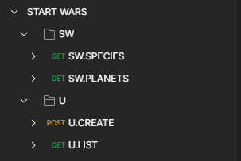
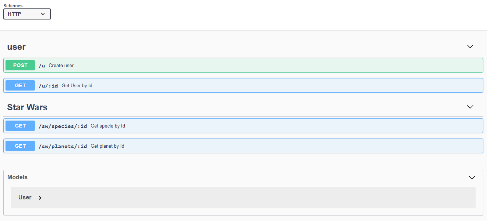

# STAR-WARS-API

<p align="center">
  <a href="https://www.serverless.com/" target="blank"></a>
</p>
<p align="center">
  <a href="https://www.mysql.com/" target="blank"></a>
</p>

## Description

An REST API with [NODEJS](https://nodejs.org/en/) and [MYSQL](https://www.mysql.com/)

## Installation

```bash
$ npm install
```

PRODUCTION
```bash
$ npm install --production
```

## Configuration

- copy .env.example and paste .env.development.local and .env.production.local
- Set .env.development.local and .env.production.local vars
- There is a only table called 'users' in db

## Running the app

```bash
# development
$ npm run start

# watch mode
$ npm run start:dev

# production mode
$ npm run start:prd
```

## Test

```bash
# unit tests
$ npm run test

# test coverage
$ npm run test:cov
```
## Lint

```bash
# lint
$ npm run lint

# lint fixer
$ npm run lint:fix
```

## Documentation
- The routes are in /postman



- GET /doc/


## Stay in touch
- Author - [Yupanqui Allcca Frank](https://fyupanquia.github.io/portfolio/)

## License

MIT [MIT licensed](LICENSE).